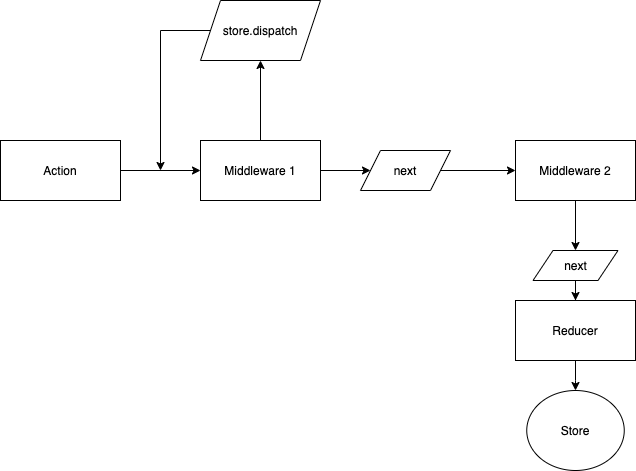

# Redux 미들웨어(Middleware)란?

- Mobx, Context API와 차별되는 Redux만의 강력한 기능이다.

## Middleware 주요 기능

- 액션이 디스패치 될 때, 액션 조건에 따라 무시되도록 만들 수 있음 (리듀서에 도달하지 않음)
- 액션이 리듀서에게 도달하기 전에 특정 기능이 실행되도록 할 수 있음
  - 액션을 콘솔에 출력
  - 액션을 수정해서 전달할 수 도 있음
  - 새로운 액션을 만들어서 dispatch 할 수도 있음
  - 특정 조건에 따라 라우터에서 이동하게 만듦

# 주요 Middleware

- redux-thunk
- redux-saga
- redux-observable
- redux-promise-middleware
- redux-logger

# 미들웨어 작동 방식

```jsx
const middleware = store => next => action => {
  // 하고 싶은 작업...
}

function middleware(store) {
  return function(next) {
    return function(action) {
      // 하고 싶은 작업...
    }
  }
}
```

- store는 state와 dispatch를 갖고 있는 함수, action은 action 객체이다.
- next는 미들웨어에서 액션을 받아왔을 때 다음 미들웨어에 전달하는 함수이다. (1개 이상 사용 가능)
  - 다음 미들웨어가 없다면 리듀서에게 전달해줌
  - next를 호출하지 않으면 action을 리듀서에 전달하지 않게 됨
- 미들웨어 내에서 새로운 dispatch를 하게 되면 처음부터 flow가 발생하지만, next는 그대로 진행함.

# 미들웨어 플로우 차트


